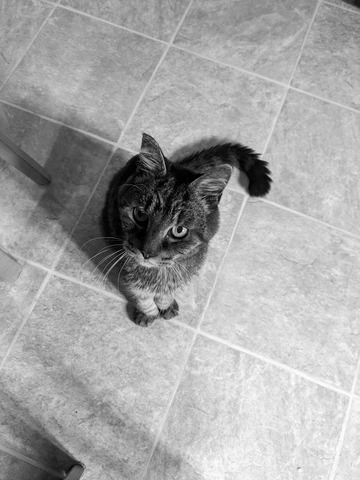

# Example: Image processing

This example computes convolves an input image with a filter for edge detection.
The input image must be in the [pgm format](https://netpbm.sourceforge.net/doc/pgm.html).
Images in most formats can be converted to pgm with ImageMagick. For example, converting
[titus.png](titus.png) should give you [titus.pgm](titus.pgm):

```bash
convert titus.png test.pgm
diff test.pgm titus.pgm  # output should be empty
```



Running this example on the `titus.pgm` should give you a result in pgm format, which,
once converted back to png, should look like the following:

```bash
pushd ../../build
./examples/image-processing/image-processing ../examples/image-processing/titus.pgm
popd
convert titus.pgm.out.pgm titus_out.png
```


